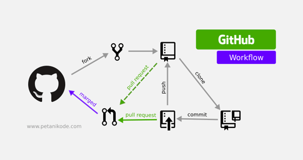

# Tech201-git-github
Tech201-git-github
## Heading 2
### Heading 3
- Let's create our Markdown
- Hello
- This line is added on local host 
Step 1 We created a file on Gitbash (mkdir)

Step 2 we then cd (change directory) in to the file

Step 3 we used pwd(to see our pathway)

Step 1: Open Git Bash
Step 2: `git mkdir` : choose a name for the directory you are going to create
Step 3: `cd` = (Change Directory) can move into other dir
Step 4: `pwd` = (print working directory) Shows you where you are.
Step 5: `git clone` + https URL in GitHub of the repository you want to clone in your local PC
Step 6: `ls` = lists files and directory
Step 7: `cd` + name of the file or directory you would like to move to
Step 8: `pwd` = (print working directory) Shows you where you are.
Step 9: `nano` + README.md = can make changes to your README.md file (documentation file)
Step 10: add the changes you've made then press "CTRL+X" to save.
Step 11: confirm the changes you made by pressing Y
Step 12: git add . = add the changes made in your local PC
Step 13: git status = confirm changes
Step 14: git commit -m = commit changes made
Step 15: git push -u origin main = push the changes made in the local network to GitHub.
Step 16: you can now refresh GitHub and confirm changes were made.

All of this was done via local host.

